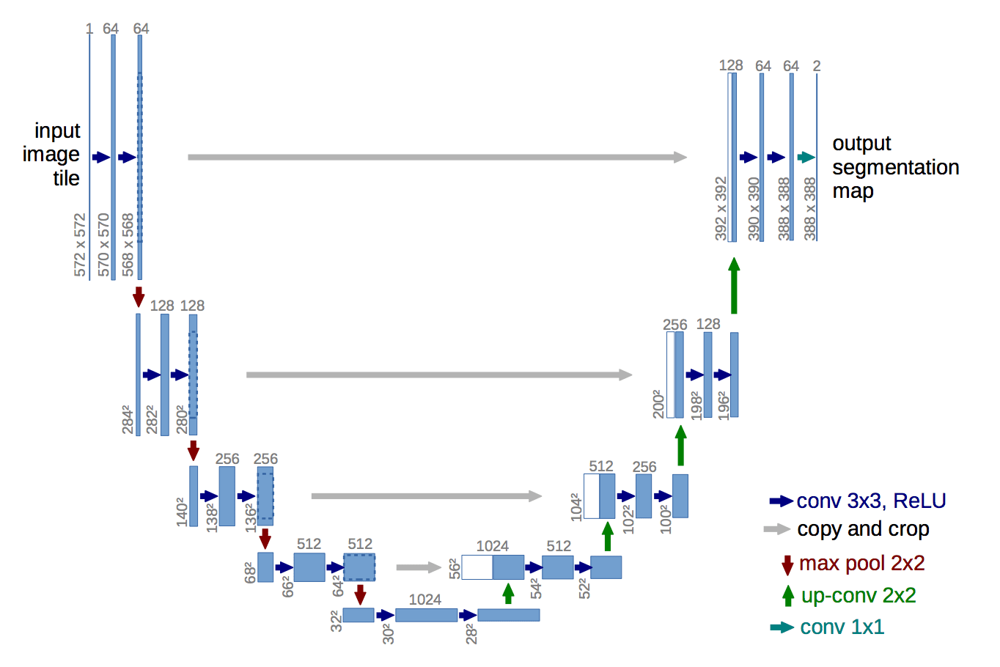

# U-Net implementation in PyTorch

The U-Net is an encoder-decoder neural network used for **semantic segmentation**. The implementation in this repository is a modified version of the U-Net proposed in [this paper](https://arxiv.org/abs/1505.04597).



## Features

1. **You can alter the U-Net's depth.**
The original U-Net uses a depth of 5, as depicted in the diagram above. The word "depth" specifically 
refers to the number of *different* spatially-sized convolutional outputs. With this U-Net implementation, you can easily vary the depth.

2. **You can merge decoder and encoder pathways in two ways.**
In the original U-Net, the decoder and encoder activations are merged by concatenating channels.
I've implemented a ResNet-style merging of the decoder and encoder activations by adding
these activations. This was easy to code up, but it may not make sense theoretically and has not been tested.

## Pixel-wise loss for semantic segmentation
I had some trouble getting the pixel-wise loss working correctly for a semantic segmentation task.
Here's how I got it working in the end.

```python
from model import UNet

model = UNet()

# set up dataloaders, etc.

output = model(some_input_data)

# permute is like np.transpose: (N, C, H, W) => (H, W, N, C)
# contiguous is required because of this issue: https://github.com/pytorch/pytorch/issues/764
# view: reshapes the output tensor so that we have (H * W * N, num_class)
# NOTE: num_class == C (number of output channels)
output = output.permute(2, 3, 0, 1).contiguous().view(-1, num_classes)
```
